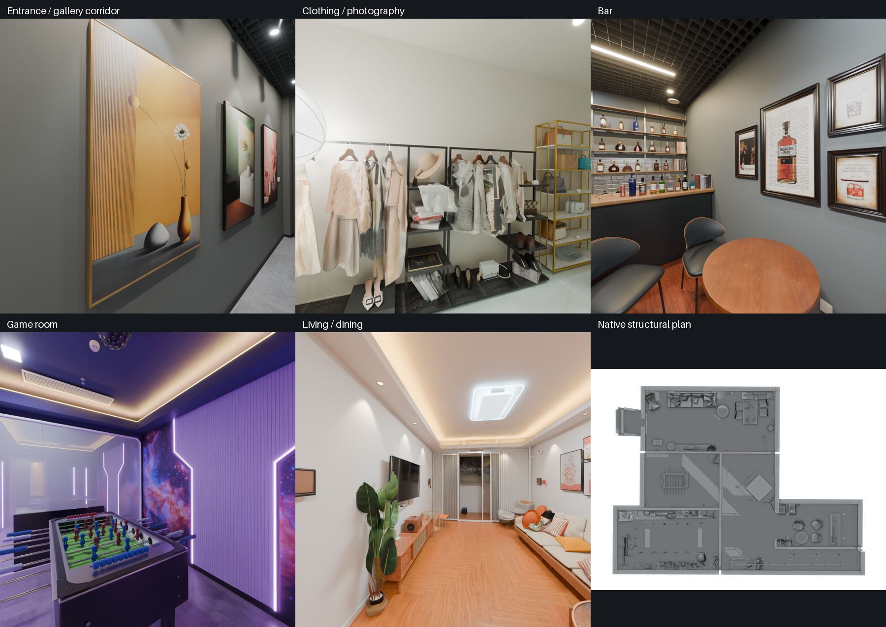
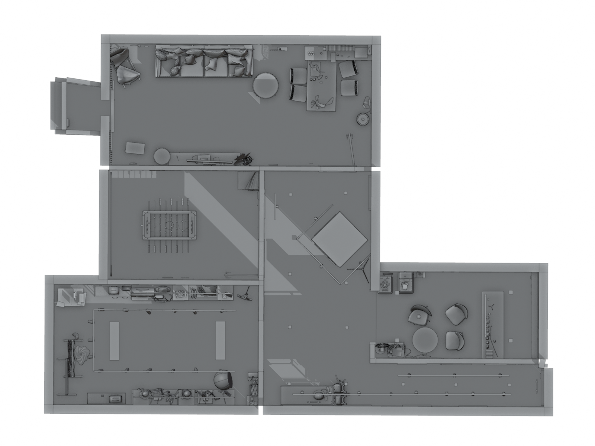
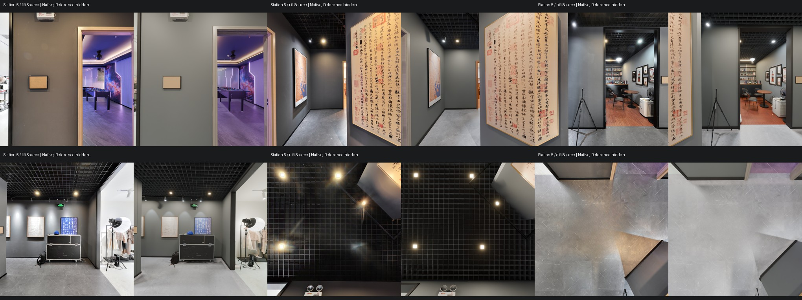

# 如何使用 Realsee 的三维重建附加产物结合 GPT-6 Astra 在 Blender 中建立可编辑的三维模型

简体中文 | [English](tutorial.en.md)

这次，我想把 GPT-6 Astra 用到一个具体任务里：拿一份 Realsee 扫描空间的资料，让它调用 Blender，把真实空间搭成可以继续修改的三维模型。

对于已经用 Realsee 拍过空间的人，这条路线很有意思。拍摄之后，除了在线浏览 VR，还可以把模型、点云、全景图和 CAD 等附加产物下载下来，交给 AI 作为建模参考。搭好的空间可以用来尝试新的布局、调整墙面和地板材质，或者制作一段漫游。

我用一个包含走廊、摄影间、酒吧、游戏间和客餐厅的项目做了尝试。下面就按上手顺序，分享怎么准备资料、怎么让 Astra 调用 Blender，以及第一版模型出来后怎么继续改。



*本次项目在 Blender 中的重建结果，原始扫描参考已隐藏。*

想对照看看原来的空间，可以直接打开 [Realsee 官方在线实景](https://realsee.ai/O3eeL2R3)。不用下载模型或扫描资料，就能在线逛一逛，和本文的 Blender 重建效果做比较。

## 1. 从 Realsee 下载附加产物

打开 Realsee 一站式制作平台，进入自己的 VR 项目，在预览页面上方找到“下载中心”，选择需要的产物，生成后下载。[官方模型下载说明](https://www.realsee.com/book/xBxQ8gg0/e0Ry7TVN)

优先找这几类资料：

| 下载什么 | 交给 Astra 做什么 |
|---|---|
| 三维模型及贴图，如 OBJ、GLB | 了解整个空间的形状，作为建模参考 |
| 点云，如 PLY、E57 | 帮助确定墙、地面、顶面的位置和空间比例 |
| 全景图 | 看清空间长什么样，参考材质、灯光和区域连接 |
| CAD 或平面图 | 理解布局、墙线和门窗位置 |

点云与 CAD 也有对应的下载入口，具体可以参考如视的[点云说明](https://www.realsee.com/book/xBxQ8gg0/Kd1ydw7h)和 [CAD 说明](https://www.realsee.com/book/xBxQ8gg0/OJ4NOt0O)。如果还有 RAW、六视图或视频，也可以一起放进资料文件夹，留给 Astra 按需查看。

这些文件各有用途：模型让它看到整体，照片补充外观，点云和图纸帮助它把空间搭得更准。手头有哪些就先整理哪些，让 Astra 看过后告诉你还缺什么。

下载后保留完整文件夹，尤其别漏掉模型旁边的贴图。这次我就遇到了引用外部贴图的 GLB，单独拿走模型文件会丢失纹理。同一个模型的几种格式可以一起放着，让 Astra 识别重复项。

## 2. 准备 Blender，让 Astra 能操作本地文件

我这次用的是 Codex 中的 GPT-6 Astra，配合电脑上安装的 Blender。Astra 可以读取项目文件、编写和运行脚本，再通过 Blender 的 Python 接口 `bpy` 创建场景、修改模型和渲染画面。

这里的“调用 Blender”，就是让 Astra 把你的要求转成建模操作，并在本机 Blender 里执行。你可以用自然语言安排任务，过程中打开工程看看结果，再继续提修改意见。

先安装好 Blender，新建一个项目文件夹，把下载的资料放进 `data/`，然后在 Codex 中打开这个项目目录。准备时只需要这样：

```text
我的空间建模项目/
└── data/
    └── Realsee 下载的资料，保留原文件夹结构
```

先发一条简单的指令，确认 Astra 能找到资料和 Blender：

```text
这是一个 Realsee 空间重建项目，原始资料都在 data/ 中。
请先看看有哪些文件，找到本机安装的 Blender，并检查能否调用。
用几句话告诉我这些资料分别能用于什么，以及还缺什么。
```

跑通这一步，再开始正式建模。后面用到的脚本、预览图和输出目录，都可以让 Astra 创建。

## 3. 把“建立可编辑空间”说清楚

正式下任务时，要让 Astra 明白你希望得到怎样的工程。比如墙、地面、顶面和门窗可以分别选择，材质可以单独修改，原来的扫描也保留在旁边方便对照。

下面这段提示词可以直接作为起点：

```text
请根据 data/ 中的 Realsee 附加产物，调用本机 Blender，
重建这个空间，并保存为 output/reconstruction_native.blend。

重点先做空间：房间布局、墙体、地面、顶面、门窗和区域之间的连接。
结合扫描模型、点云、CAD 和全景图理解现场，保持实际空间比例。

墙、地面、顶面、门框和门扇要有各自可编辑的原生模型与材质。
保留原始扫描作为可隐藏的参考。
家具和小物件等空间主体完成后再补充。

先给我一版能看清布局的空间模型和几张预览图，
再对照现场资料继续完善材质与灯光。
每完成一个阶段都保存工程，并简要说明完成了什么。

请实际执行建模。最后重新打开保存的 .blend 文件，
确认模型、贴图都正常，也能继续编辑。
```

这段指令把任务分成了几个容易观察的阶段：先搭空间，再看布局，之后补外观。你不用一开始就把每段墙怎么建、相机怎么对齐全部写出来，这些具体操作交给 Astra 根据资料处理。

## 4. 看着预览图，像沟通设计方案一样继续修改

第一版出来后，先看整体：房间有没有漏，走廊是否连通，门窗位置是否对，顶面是不是现场的样子。这个时候，一张俯视图往往比一张精致的室内效果图更有用。



*隐藏顶面后的空间布局，便于查看房间和走廊的关系。图中已经补入了家具。*

发现问题后，直接指出区域和你看到的差异。例如可以这样继续说：

```text
先把家具隐藏，给我看整个空间的俯视图，重点检查房间和走廊的连接。
```

或者：

```text
摄影间通向走廊的位置，请再对照原始全景图检查。
先修正墙、开口和顶面的关系，再处理装饰细节。
```

空间基本搭对后，就可以把注意力转向材质和灯光：

```text
请对照全景图调整墙面、地板和顶面的材质，补上主要灯光。
把现场照片和相同视角的渲染图放在一起，方便我比较。
```



*每组左边是现场照片，右边是 Blender 渲染。用这种方式看，哪些地方还需要改会清楚很多。*

这也是我觉得这套用法最有价值的地方：你可以围绕看到的空间持续沟通。比如“走廊太亮了”“这个开口形状不对”“先保留现有布局，换一种墙面”。Astra 负责把这些反馈落实到 Blender，你负责判断效果是不是自己想要的。

家具和小物件放在后面处理就好。先把空间搭稳，再决定哪些陈设值得细做，整个过程会更容易把握。

## 5. 打开工程，开始用这个空间做点新东西

拿到 `.blend` 文件后，在 Blender 中打开它，试着单独选中一段墙、一个门框或一块地板，再改改材质、隐藏顶面，看看空间。这些动作能很直观地告诉你，模型是否方便继续使用。

也可以让 Astra 继续帮忙：

```text
复制一份当前工程，尝试新的墙面和地板配色，给我几张对比图。
```

```text
为这个空间制作一段从入口出发的漫游，经过主要区域。
相机路线保留在 Blender 工程里，方便之后调整。
```

这个项目最后完成了[可编辑的原生工程](releases.md#案例文件)，也制作了一段 [85 秒的漫游视频](releases.md#案例文件)。空间从原来的扫描资料，变成了可以继续调整、渲染和展示的 Blender 场景。代码、预览图、模型与视频都已公开，下载方式见案例文件说明。

如果你手里已经有一个 Realsee 项目，可以从下载附加产物开始，把资料放进文件夹，让 Astra 先搭出第一版空间。打开看看，再告诉它下一步想改什么。
